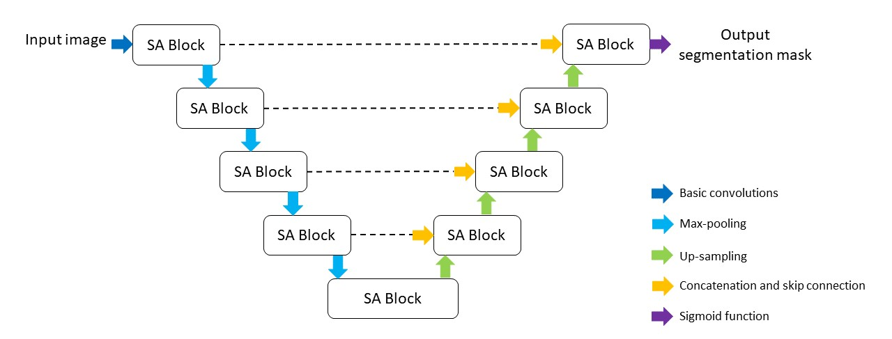

# An Automatic Nuclei Image Segmentation Based on Split-Attention U-Net  
In this research, we propose a network called Split-Attention U-Net (SA-Unet) for further improving the performance of cell segmentation. SA-Unet is based on U-Net architecture and the original blocks used to down-sampling and up-sampling paths are replaced with Split-Attention blocks for capturing independent distinct attributes of cells.

## Architecture

## Dataset
A public microscopy image dataset from 2018 Data Science Bowl grand challenge is selected to train the SA-Unet model:
>[https://www.kaggle.com/c/data-science-bowl-2018/data/](https://www.kaggle.com/c/data-science-bowl-2018/data)

## Evaluation Results
|  Method  | Avg. Accuracy  | Avg. Precision  | Avg. Recall  | Avg. F1-Score | Avg. IoU |
|  ----     |  ----  | ----  | ----  | ----  | ----  |
| U-Net  | 0.9337 | **0.9522** | 0.8377 | 0.8853 | 0.8030 |
| SA-Unet  | **0.9397** | 0.9267 | **0.9069** | **0.9133** | **0.8467** |

## Reference
1. Zhang, Hang, Chongruo Wu, Zhongyue Zhang, Yi Zhu, Zhi Zhang, Haibin Lin, Yue Sun et al. "Resnest: Split-attention networks." arXiv preprint arXiv:2004.08955 (2020)
2. Ronneberger, Olaf, Philipp Fischer, and Thomas Brox. "U-net: Convolutional networks for biomedical image segmentation." In International Conference on Medical image computing and computer-assisted intervention, pp. 234-241 (2015)
